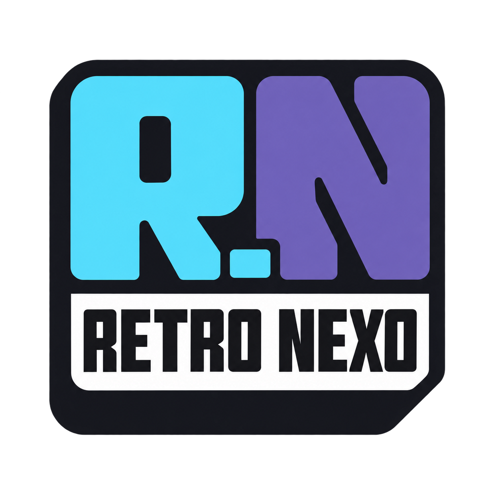
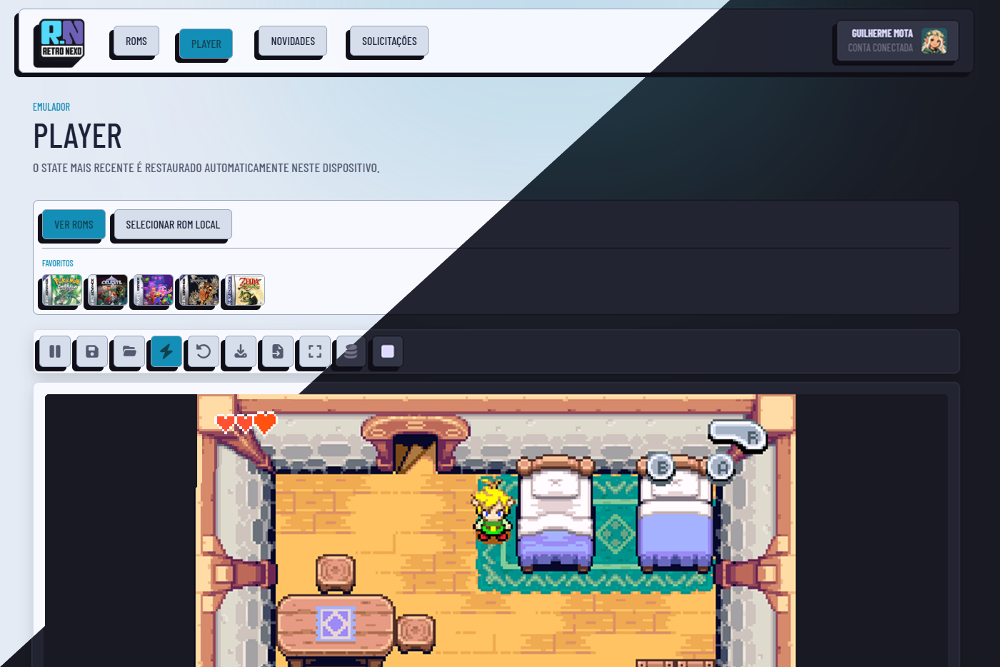
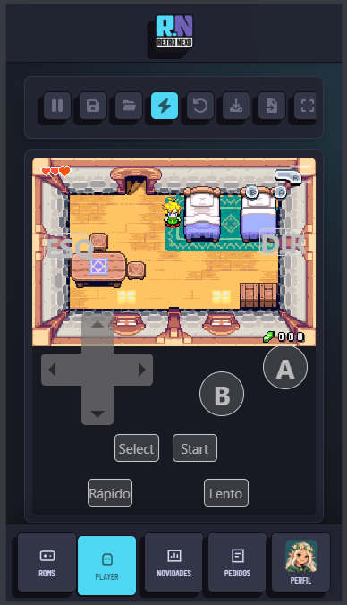

<p align="center">
  
</p>

---

<p align="center">
  Bem-vindo à RetroNexo — uma nova forma de reencontrar os jogos que marcaram gerações.
</p>

<p align="center">
  
  &nbsp;
  
</p>

Aqui, sua nostalgia não fica parada em uma estante: ela ganha uma biblioteca viva, organizada e pronta para jogar. Explore títulos clássicos, pesquise por nome, gênero ou plataforma, consulte os detalhes de cada ROM e inicie sua próxima partida diretamente no navegador.

A RetroNexo também é feita para a experiência de sala. Com o modo Big Picture, a biblioteca ocupa a tela inteira e ganha uma navegação inspirada em consoles: encontre jogos, filtre seus favoritos, pesquise títulos e carregue suas próprias ROMs sem sair da imersão. O modo foi pensado para funcionar com teclado, mouse e controles compatíveis com XInput — direcionais para navegar, A para selecionar, Y para buscar e B para voltar.

Prefere jogar sua própria coleção? Basta carregar uma ROM do seu dispositivo. A plataforma reconhece arquivos de Game Boy, Game Boy Color, Game Boy Advance, NES, Super Nintendo, Nintendo 64, Nintendo DS, PlayStation e Mega Drive, entre outros formatos compatíveis. Assim, sua biblioteca pessoal também tem espaço na RetroNexo.

No player, os clássicos rodam pelo navegador com recursos para uma sessão sem interrupções: pausar e retomar, tela cheia, quick save e quick load, criação de states manuais, histórico de states, restauração automática do save mais recente neste dispositivo, importação e exportação de states e limpeza do cache do emulador quando você precisar liberar espaço. Jogos compatíveis ainda podem receber configurações específicas, como BIOS, patches, cheats, shaders e ajustes de controle.

Sua conta deixa tudo mais pessoal. Favorite os jogos que merecem estar sempre por perto, mantenha sua seleção pronta para jogar e escolha seu avatar. A interface também acompanha seu estilo, com temas claro e escuro e uma experiência responsiva para desktop e mobile.

E a biblioteca continua crescendo com a comunidade. Não encontrou uma ROM que gostaria de jogar? Envie uma solicitação com a plataforma e os detalhes desejados. Outros jogadores podem votar nos pedidos e, ao chegar a 15 votos, a solicitação recebe prioridade máxima.

RetroNexo não é apenas uma lista de ROMs. É o seu ponto de encontro com os clássicos: uma biblioteca, um player, uma experiência de sofá e uma comunidade reunidos no mesmo lugar. Escolha um jogo, aperte start e volte para onde tudo começou.


## Créditos

A experiência de emulação da RetroNexo é viabilizada pelo EmulatorJS, uma biblioteca open source que torna possível executar diversos sistemas clássicos diretamente no navegador.

Nosso agradecimento especial ao projeto EmulatorJS, a seus mantenedores e contribuidores — incluindo Tamebm — pelo trabalho que ajuda a preservar, compartilhar e manter viva a história dos videogames.

EmulatorJS é um projeto independente, utilizado pela RetroNexo como base tecnológica para a emulação no navegador.


## Tecnologias

- React, TypeScript e Vite
- Tailwind CSS
- Firebase Authentication e Firestore
- Prismic CMS
- Zustand
- EmulatorJS
- Font Awesome

## Recursos

- Biblioteca de ROMs, favoritos e solicitações
- Execução local e remota de ROMs no EmulatorJS
- States locais com restauração automática, histórico, importação e exportação
- Interface responsiva para desktop e mobile, com temas claro e escuro

## Executar localmente

```bash
npm install
npm run dev
```

Copie `.env.example` para `.env` e configure as credenciais do Firebase e do Prismic.
